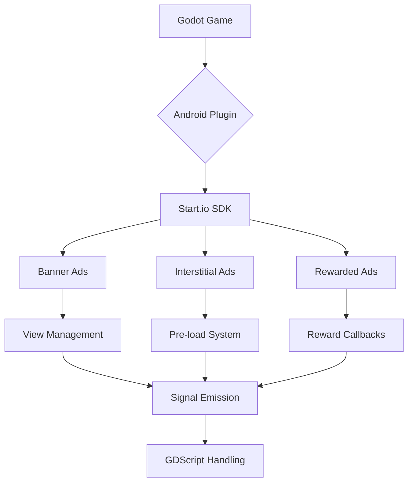

```markdown
# Start.io Android Plugin for Godot 3

## Design Rationale

This plugin was developed with these core principles:

### 1. Native Android Integration
- **Why?** Direct SDK access ensures full feature utilization and better performance
- **Implementation:**  
  Uses official Start.io SDK (`com.startapp:inapp-sdk`) with proper lifecycle management

### 2. Thread Safety
- **Why?** Android requires UI operations on main thread
- **Implementation:**  
  ```kotlin
  runOnUiThread {
      // All ad operations
  }
  ```

### 3. Godot Engine Compatibility
- **Why?** Seamless integration with GDScript
- **Implementation:**  
  ```kotlin
  override fun getPluginSignals(): Set<SignalInfo> = setOf(
      SignalInfo("onBannerAdLoaded"),
      // 12+ managed signals
  )
  ```

### 4. Error Resilience
- **Why?** Prevent crashes from ad failures
- **Implementation:**  
  ```kotlin
  emitSignal("onRewardedAdFailed", ad?.errorMessage ?: "Load failed")
  restoreGodotFocus()
  ```

## Key Architecture Decisions

### Ad Type Handling
| Ad Type | Implementation Strategy |
|---------|-------------------------|
| **Banner** | Dynamic view positioning with `FrameLayout` |
| **Interstitial** | Pre-load system with auto-reload |
| **Rewarded** | Video completion callback system |

### Focus Management
```kotlin
private fun restoreGodotFocus() {
    activity.window.clearFlags(FLAG_NOT_FOCUSABLE)
    activity.window.addFlags(FLAG_NOT_TOUCH_MODAL)
}
```
*Ensures proper game control restoration after ad dismissal*

## Performance Considerations

1. **Memory Efficiency**  
   - Null checks before ad operations
   - Proper view cleanup
   ```kotlin
   (it.parent as? FrameLayout)?.removeView(it)
   bannerAd = null
   ```

2. **Network Optimization**  
   - Automatic interstitial pre-loading
   - Smart error recovery system

## Why These Requirements?

- **Minimum API 21 (Lollipop):**  
  Start.io SDK requirements + 95% Android device coverage

- **Godot 3.5+:**  
  Required for modern Android plugin architecture support

- **Test Mode Recommendation:**  
  Avoid accidental ad clicks during development
  ```gdscript
  configureAds("TEST_ID", true)
  ```

## Core Implementation Flow



## Critical Code Sections

### 1. Banner Positioning
```kotlin
gravity = when (position.lowercase()) {
    "top" -> Gravity.TOP or Gravity.CENTER_HORIZONTAL
    else -> Gravity.BOTTOM or Gravity.CENTER_HORIZONTAL
}
```

### 2. Reward Verification
```kotlin
setVideoListener(object : VideoListener {
    override fun onVideoCompleted() {
        emitSignal("onRewardedAdCompleted")
    }
})
```

### 3. Interstitial Reload
```kotlin
override fun adHidden(ad: Ad?) {
    loadInterstitialAd() // Auto-reload after close
}
```

## Security Considerations

- **No sensitive permissions** - Only requires:
  ```xml
  <uses-permission android:name="android.permission.INTERNET"/>
  <uses-permission android:name="android.permission.ACCESS_NETWORK_STATE"/>
  ```

- **Test mode isolation** - Separate development/production ad IDs

This design ensures compliance with Google Play policies while maintaining optimal game performance.
```